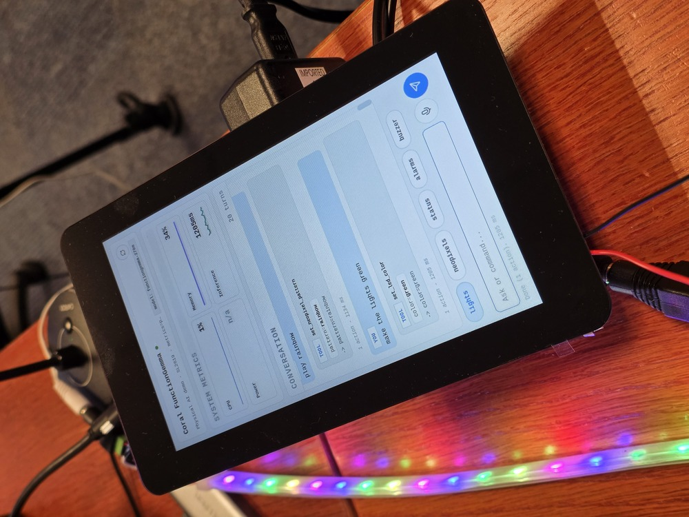
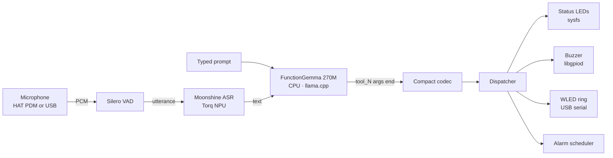

# FunctionGemma — On-Device Voice + Text Physical AI

> Natural-language commands → real hardware, end-to-end on a 2-core A55. No cloud, no API keys, no wake word.

<p align="center">
  
</p>
<p align="center"><em>The PyQt UI on the 7" panel after the prompt "play rainbow" — Neopixels alive at the bottom, tool-call log on the right.</em></p>

<p align="center">
  
  
  
  
</p>

A fine-tuned **FunctionGemma 270M** turns natural-language commands into compact tool calls that dispatch to real HAT hardware: status LEDs (sysfs), a piezo buzzer (libgpiod), and an optional Adafruit Mini Sparkle Motion driving a 48-pixel WS2812B Neopixel ring over USB serial. A single unified `set_lights` tool covers both LED surfaces — the model parses intent into semantic args (color/effect/state) and the dispatcher routes to whichever hardware is connected.

**Why it's fast:** trained Octopus-v2 style — one functional token per tool, **no tool schema in the prompt**. The on-device prompt is ~13 tokens, and cold prefill on the 2-core Cortex-A55 lands at **~0.48 s** (synthetic benchmark).

**End-to-end on the board:** model load ~3.3 s, warmup ~1.1 s, then every user turn — including the first — runs in **~1.3–2.0 s** for action tools and ~2.9 s for the `respond()` fallback. Sub-2 s is the norm, not the exception.

---

## Contents

- [Requirements](#requirements)
- [Quick start](#quick-start)
- [Try saying...](#try-saying)
- [How it works](#how-it-works)
- [Running the demo](#running-the-demo)
- [Voice input](#voice-input)
- [WLED Neopixel ring (optional)](#wled-neopixel-ring-optional)
- [Auto-start on boot (systemd)](#auto-start-on-boot-systemd)
- [CLI reference](#cli-reference)
- [Tool schema (6 functions, v10)](#tool-schema-6-functions-v10)
- [Effects](#effects)
- [Hardware reference](#hardware-reference)
- [Model and training](#model-and-training)
- [Project layout](#project-layout)
- [Known model behaviors](#known-model-behaviors)
- [Troubleshooting](#troubleshooting)
- [Related work](#related-work)
- [Contributing and support](#contributing-and-support)

---

## Requirements

**Required**
- **Synaptics Coralboard (SL2619)** with the Grinn Coral HAT (RGB status LEDs + piezo buzzer)
- **Astra SDK OOBE image** — ships with `git`, `python3`, `gstreamer`, `gpiod`, and `weston`
- ~500 MB free disk for the model and Python venv
- Network access for `setup_demo.py` to fetch model files (or pre-populate `models/` offline)

**Optional**
- **Adafruit Mini Sparkle Motion (6314)** running WLED firmware over USB-CDC — for the Neopixel ring
- **Adafruit 48-pixel WS2812B ring (2539)** wired to the Sparkle Motion
- A microphone for voice input — either the HAT's PDM mic (`alsasrc hw:0,0`) or any USB mic

---

## Quick start

```bash
# 1. Clone
git clone --recurse-submodules https://github.com/synaptics-astra-demos/sl2610-examples.git
cd sl2610-examples

# Existing clones only:
git submodule update --init --recursive

# 2. Shared venv + Python deps
python3 -m venv .venv --system-site-packages
source .venv/bin/activate

# Install general dependencies
pip install -r requirements.txt

# Install example-specific dependencies

cd Function_calling
pip install -r requirements.txt

# 3. Download FunctionGemma + Moonshine model files
python setup_demo.py

# 4. Run it

python3 demo.py                # CLI REPL (works in any terminal)
```

[!WARNING] Please note that different examples require different versions of the Python Torq runtime. If using a shared virtual environment, always re-run installation of example-specific dependencies when switching between examples.


The model loads in ~3.6 s, then you're at a prompt. To run the PyQt UI from a fresh terminal without systemd, see [Running the demo](#running-the-demo) for the Wayland env vars.

To enable voice (Moonshine ASR on the Torq NPU), install the PortAudio system libraries once with `../configs/install_portaudio.sh`, then run `bash scripts/install-service.sh --voice moonshine`.

`setup_demo.py` is idempotent — re-run it anytime to repair missing model files. 

For offline Python dependency installs, use `pip install --no-index --find-links=../wheelhouse -r requirements.txt`.

---

## Try saying...

The following are **verbatim** REPL outputs from the v10 model running on the SL2619 — not simulated, captured from a single REPL session:

```text
>>> Turn the red light on
  set_lights: color=red state=on
  (1 tool call · 1821 ms)

>>> Turn off the lights
  set_lights: state=off
  (1 tool call · 1293 ms)

>>> Show fireworks on the neopixels
  set_lights: effect=fireworks state=on
  (1 tool call · 1936 ms)

>>> Play a siren
  play_buzzer: pattern=siren
  (1 tool call · 1374 ms)

>>> How much memory is free?
  get_system_status: {'memory': 38.4}
  (1 tool call · 1355 ms)

>>> Hello there
  respond: Hi there. Try "turn the lights on" or "play a beep".
  (1 tool call · 2876 ms)
```

In v10, the unified `set_lights` tool handles every LED-related prompt — "the lights", "the LEDs", "the neopixels", "the strip" all route the same way. The dispatcher resolves at runtime which hardware to drive (HAT 3-LED indicators or WLED ring) based on what it detects, so the model never has to guess. See [Tool schema](#tool-schema-6-functions-v10) for the full surface.

---

## How it works



Three things make this work on a 2-core A55:

1. **Octopus v2 functional tokens.** Each tool is a single token (`<tool_0>` ... `<tool_7>`) baked into the model weights. The on-device prompt is `<start_of_turn>user\n{query}<end_of_turn>\n<start_of_turn>model\n` and nothing else — no JSON schema, no examples, no system message.
2. **CPU governor pinned to `performance`.** The OOBE image defaults to `schedutil`, which causes a 3× slowdown from cold. `cpu_governor.py` flips this on startup.
3. **Moonshine runs on the Torq NPU, not the CPU.** ASR is decoupled from LLM decode, so a spoken utterance and an in-flight tool call don't fight for the same 2 cores.

The compact codec (`compact_codec.py`) parses `<tool_N>(arg1,arg2)<end>` back into a `ToolCall`. The dispatcher (`dispatcher.py`) validates args against `tools.json` and invokes a method on `HardwareDevice` (`hardware.py`). Everything stays local — no network, no cloud inference.

---

## Running the demo

For interactive runs of the PyQt UI from a terminal, export the Wayland env vars first so Qt can find the OOBE image's weston compositor. The systemd service handles this automatically on autostart.

```bash
export XDG_RUNTIME_DIR=/var/run/user/0
export WAYLAND_DISPLAY=wayland-1
export QT_QPA_PLATFORM=wayland
export WESTON_DISABLE_GBM_MODIFIERS=true
```

For portrait mode on 800x480 display:
```bash
export ORIENTATION=portrait
export DISPLAY_HEIGHT=800
export DISPLAY_WIDTH=480
```

Run either entrypoint:

```bash

# Interactive REPL
python3 demo.py

# One-shot prompt (~5-6 s end-to-end from cold: load + warmup + decode)
python3 demo.py --prompt "Turn the red light on"

# PyQt UI
python3 app_pyqt.py

# PyQt UI full-screen on the 7" panel
python3 app_pyqt.py --fullscreen
```

In the PyQt UI: `Ctrl+P` snapshots the window to `/tmp/`. `Esc` quits.

# Install as a service

For the PyQt UI app on the 7" panel, install as a systemd service — it handles the Wayland env vars and autostarts on boot:
```bash
bash scripts/install-service.sh
```


### Expected output (REPL)

```text
Loading model from functiongemma-physical-ai-v10-Q5_K_M.gguf done in 3.3s.
auto-detected WLED port: /dev/ttyACM0
HardwareDevice ready (status_leds=3, wled=yes, gpiod=yes, buzzer=gpiochip0 6)
Warming up done in 1.1s.
Ready. /help for commands, Ctrl-D or /exit to leave.
>>> Turn the red light on
  set_lights: color=red state=on
  (1 tool call · 1821 ms)
>>>
```

`auto-detected WLED port` only appears when a Mini Sparkle Motion is plugged in. With no `/dev/ttyACM*` device present you'll see `no WLED device detected — running in HAT-only mode` instead, and `wled=no` in the next line.

---

## Voice input

The PyQt UI grows a **Mic** button when voice is enabled, and the REPL accepts spoken utterances mixed with typed input. Both entrypoints take the same `--voice` flag:

| Mode | What it does |
|---|---|
| `--voice off` (default) | No voice. Mic button hidden, spoken input ignored. |
| `--voice stub` | Real mic + VAD; ASR returns rotating canned phrases. Use to validate the mic → VAD → dispatcher path without a real ASR model. |
| `--voice moonshine` | Real mic + VAD + Moonshine ASR on the Torq NPU. Reads VMFB artifacts from `--moonshine-dir` (default `models/Synaptics/moonshine-tiny-bf16-torq/`, populated by `setup_demo.py`). |

```bash
# Validate plumbing with stubbed ASR
python3 app_pyqt.py --voice stub

# Real Moonshine ASR on Torq
python3 app_pyqt.py --voice moonshine

# Pin to the HAT PDM mic explicitly
python3 app_pyqt.py --voice moonshine --mic 0
```

`requirements.txt` installs the voice Python dependencies (`sounddevice`, `silero-vad-notorch`, `tokenizers`, `huggingface_hub`, and `torq_runtime`). Silero VAD pulls ONNX Runtime for its backend. `setup_demo.py` downloads the Moonshine artifacts managed by `torq-examples` (encoder + decoder VMFBs, decoder token embeddings, and tokenizer) from `Synaptics/moonshine-tiny-bf16-torq` on HuggingFace. Install `libportaudio.so.2` with `../configs/install_portaudio.sh`; the OOBE image doesn't ship it.

If `tokenizer.json` is ever missing at runtime, the ASR worker falls back to fetching it from `UsefulSensors/moonshine-tiny`. For fully offline use after a partial install:

```bash
wget -O ../models/Synaptics/moonshine-tiny-bf16-torq/tokenizer.json \
  https://huggingface.co/UsefulSensors/moonshine-tiny/resolve/main/tokenizer.json
```

**REPL caveat:** in `demo.py --voice` you can talk *or* type. Voice transcription completes asynchronously, so if a spoken utterance arrives while you're mid-keystroke at the `>>>` prompt, the readline buffer is dropped and you have to retype. Acceptable for headless smoke tests; the PyQt UI doesn't have this problem.

---

## WLED Neopixel ring (optional)

Plug an Adafruit Mini Sparkle Motion (6314) running WLED firmware + a WS2812B Neopixel ring (Adafruit 2539) into a USB-A port. Verify it enumerates and then just run the demo — auto-detect picks up the first `/dev/ttyACM*` and the dispatcher routes `set_lights` calls to the ring automatically:

```bash
ls /dev/ttyACM*               # confirm the Sparkle Motion enumerated
python3 demo.py               # auto-detect handles the rest
python3 app_pyqt.py --fullscreen
```

To pin a specific device or to disable WLED while one is plugged in:

```bash
python3 demo.py --wled-port /dev/ttyACM1   # pin
python3 demo.py --no-wled                  # force HAT-only
```

Without WLED hardware, `set_lights` calls route to the HAT 3-LED indicators automatically — non-RGB colors are mapped to the closest red/green/blue combo, and effects are approximated on the 3 LEDs. The rest of the demo (buzzer, alarms, system status, chat) works unchanged.

---

## Auto-start on boot (systemd)

After the venv has the requirements installed and `setup_demo.py` has downloaded the model files, install the systemd service to launch the PyQt demo full-screen at boot:

```bash
bash scripts/install-service.sh
```

By default the unit runs `app_pyqt.py --fullscreen`. To pass extra flags at install time, append them — they're baked into the generated `ExecStart=` line:

```bash
bash scripts/install-service.sh --wled-port /dev/ttyACM0
bash scripts/install-service.sh --voice stub --mic 0
```

Other flags:

- `--no-enable` — install the unit but don't enable it on boot
- `--no-start` — enable on boot but don't start it now

The unit:

- waits for `weston.service` (the OOBE image's Wayland compositor)
- exports the Wayland env vars (`XDG_RUNTIME_DIR`, `WAYLAND_DISPLAY`, `QT_QPA_PLATFORM`, `WESTON_DISABLE_GBM_MODIFIERS`)
- runs as `root` from `Function_calling/` with the venv's `python3`
- restarts on failure (5 s back-off, 120 s start timeout — v9 cold start to first response is ~5-6 s, plenty of headroom)
- on stop drives `gpioset $(gpiofind BUZZERn)=1` so the buzzer is silenced even after `SIGKILL`

Day-to-day:

```bash
systemctl status functiongemma-demo
journalctl -u functiongemma-demo -f       # follow logs
systemctl restart functiongemma-demo      # after editing source

bash scripts/uninstall-service.sh         # remove
```

---

## CLI reference

Every runtime knob is a CLI flag — no env vars to remember, no config files to edit. Both `demo.py` and `app_pyqt.py` accept the same flags except where noted.

| Flag | Default | Applies to | Purpose |
|---|---|---|---|
| `--model PATH` | `../models/functiongemma-physical-ai-v10-Q5_K_M.gguf` | both | GGUF path |
| `--prompt TEXT` | — | `demo.py` | One-shot prompt, then exit |
| `--voice MODE` | `off` | both | `off` / `stub` / `moonshine` |
| `--mic INDEX_OR_NAME` | system default | both | Sounddevice device index or substring (e.g. `0`, `hw:0,0`, `USB`) |
| `--moonshine-dir PATH` | `../models/Synaptics/moonshine-tiny-bf16-torq/` | both | Where Moonshine VMFB + tokenizer live |
| `--wled-port PATH` | auto-detect `/dev/ttyACM*` | both | Pin a specific Mini Sparkle Motion serial device. Omit to use the first `/dev/ttyACM*` found. |
| `--no-wled` | off | both | Disable WLED entirely, even if a serial device is present |
| `--wled-baud N` | `115200` | both | WLED serial baud rate |
| `--screenshot-dir PATH` | `/tmp` | `app_pyqt.py` | Where `Ctrl+P` writes PNGs |
| `--fullscreen` | off | `app_pyqt.py` | Skip window decorations, fill the 7" panel |

---

## Tool schema (6 functions, v10)

| Tool | Args (all optional unless noted) | Effect |
|---|---|---|
| `set_lights` | `color?`, `effect?`, `state?` | Unified LED tool. Dispatcher routes to whichever hardware is connected — HAT 3-LED indicators when no WLED, or the WLED strip/ring when present. Hardware-agnostic at the model layer. |
| `play_buzzer` | `pattern` (required) | Named pattern on the binary-GPIO buzzer (`beep`, `double_beep`, `chirp`, `siren`, `alarm`, `success`, `error`) |
| `set_alarm` | `duration` \| `time`, `label?` | Schedule alarm (buzzer + red flash on whatever lights are connected) |
| `cancel_alarm` | `label?` | Cancel one or all alarms |
| `get_system_status` | `metric?` | CPU / memory / temperature / NPU |
| `respond` | `message` (required) | Natural-language reply when no physical-action tool fits, or for clarification on ambiguous prompts |

v10 emits **named args** per the Mercedes-Benz Octopus v2 paper ([arXiv 2501.02342](https://arxiv.org/abs/2501.02342)) — calls look like `<tool_0>(color="red", state="on")<end>`. The model only emits the args the user actually implied; absent optional args are simply not present in the call. This is a deliberate change from v9's positional-arg format and is what makes a 270M model robust enough to leave brightness/count/speed off `set_lights` (the dispatcher's defaults cover them).

The full schema with descriptions lives in `tools.json`. It is the source of truth for dispatcher arg validation and is embedded as GGUF metadata for drift checks; it's **not** injected into the inference prompt — Octopus v2 means the functional tokens carry all the routing.

### `set_lights` arg semantics

| Arg | Values | Notes |
|---|---|---|
| `color` | `red`, `green`, `blue`, `white`, `yellow`, `purple`, `orange`, `pink`, `cyan` | HAT mode maps non-RGB colors to the closest 3-LED combo (e.g. yellow = red + green) |
| `effect` | `solid`, `blink`, `pulse`, `fade`, `rainbow`, `fire`, `plasma`, `aurora`, `police`, `fireworks`, `sparkle`, `twinkle`, `chase`, `comet`, `heartbeat`, `lightning`, `glitter`, `loading`, `sunrise`, `off` | Strip mode hits WLED firmware effects natively; HAT mode approximates on 3 LEDs |
| `state` | `on`, `off` | Use when toggling without a color or effect |

### Routing discipline

Bare ambiguous prompts route to `respond()` with a clarification rather than guessing:

| Prompt | Routes to... |
|---|---|
| `rainbow` (bare) | `respond("Did you mean the lights? Try 'rainbow on the lights'.")` |
| `siren` (bare) | `respond("Did you mean the buzzer? Try 'play a siren'.")` |
| `on` / `off` (bare) | `respond("On what? Try 'turn the lights on'.")` |

Hardware-naming vocabulary that all route to `set_lights`: `lights`, `LEDs`, `the strip`, `indicators`, `neopixels`, `the ring`, `<color> light/lights`, etc. This is intentional — the v10 model is hardware-agnostic; the dispatcher resolves hardware at runtime.

---

## Effects

Strip mode hits each WLED firmware effect natively; HAT mode approximates on the 3 status LEDs.

| Effect | WLED fx | Visual role |
|---|---|---|
| `solid` | 0 | Static color (uses `color`) |
| `pulse` | 2 (Breathe) | Voice activity / breathing |
| `fade` | 12 | Gentle fade |
| `blink` | — | Hard on/off cycle |
| `chase` | 28 | Runners on dim trail |
| `rainbow` | 9 | Spectrum spread (`color` ignored) |
| `sparkle` | 20 | Random twinkle on solid bg |
| `aurora` | 38 | Northern Lights ambient |
| `plasma` | 97 | Plasma lamp |
| `comet` | 41 (Lighthouse) | Trailing dot — "thinking" |
| `twinkle` | 80 (TwinkleFox) | Gentle random twinkle |
| `fireworks` | 42 | Random color blobs — celebration |
| `police` | 49 | Red/blue alternating — alert |
| `heartbeat` | 100 | Biological pulse |
| `loading` | 47 | Sawtooth fill — "processing" |
| `lightning` | 57 | White random flash — storm |
| `glitter` | 87 | Rainbow + white sparkles |
| `fire` | 66 (Fire 2012) | Flickering fire |
| `sunrise` | 104 | Gradual sunrise — slow ambient |
| `off` | — | Turn ring off (sends `on: false`) |

v10 trimmed the previous `palette` and `intensity` args off `set_lights` after a failure-mode analysis showed they appeared in zero observed voice failures, and the dispatcher's defaults (palette = effect default, intensity = medium) cover them. If a future board needs them back, restore in `lights.py` and retrain.

---

## Hardware reference

- **Synaptics Coralboard (SL2619)** with the Grinn Coral HAT — RGB status LEDs at `/sys/class/leds/{red,green,blue}:status/brightness`, piezo buzzer on `BUZZERn` (binary GPIO).
- **Optional Adafruit Mini Sparkle Motion (6314)** running WLED firmware, enumerated as `/dev/ttyACM0` over USB-CDC. Drives a 48-pixel WS2812B / SKC6812RV ring (Adafruit 2539).

### Buzzer wiring note

Despite the schematic name suggesting active-low, `BUZZERn` on the Grinn Coral HAT is electrically wired such that the buzzer **silences on the line being driven HIGH and beeps when LOW**. The kernel device tree marks the line `active-high` — so `gpioset gpiochip0 6=1` drives physical HIGH = silent, `=0` = beep. The chip driver also retains the last-driven value across `gpioset --mode=exit`, so once a value is written the line holds it.

`hardware.py` writes the inverted polarity (`0` to beep, `1` to silence). If you port this code to a board with the polarity wired the other way, flip the `_BUZZER_OFF` / `_BUZZER_ON` constants at the top of `hardware.py`. Verify with `gpioinfo gpiochip0` (look for the line named `"BUZZERn"`).

### Crash-safe cleanup

The demo guarantees the buzzer and status LEDs return to a silent/off state on every exit path the Python interpreter can observe:

- Normal exit (`/exit`, EOF, end of `--prompt`)
- Uncaught exceptions
- `KeyboardInterrupt` (Ctrl-C / SIGINT) mid-pattern
- `SIGTERM` (e.g. `kill <pid>`, init shutdown)
- `SIGHUP` (terminal close, parent process death)
- A fresh demo loading `hardware.py` after a crashed prior process

Layered as `try/finally` inside `play_buzzer` + the alarm-flash helper, a `HardwareDevice.cleanup()` called from a `finally` block in `main()`, signal handlers for `SIGTERM`/`SIGHUP`, and an `atexit` net.

`SIGKILL`, kernel OOM kill, segfault, and power loss bypass all in-process cleanup. The systemd unit installed by `scripts/install-service.sh` carries an `ExecStopPost=` that drives `BUZZERn` back to silent on every service exit, including `SIGKILL` — so the buzzer can never latch ON across an unclean restart.

---

## Model and training

Hosted on HuggingFace: [`BrinqAI/functiongemma-270m-physical-ai`](https://huggingface.co/BrinqAI/functiongemma-270m-physical-ai) → `functiongemma-physical-ai-v10-Q5_K_M.gguf` (248 MB).

- **Base:** [`google/functiongemma-270m-it`](https://huggingface.co/google/functiongemma-270m-it)
- **Style:** Fine-tuned [Octopus v2](https://arxiv.org/abs/2404.01744) — one functional token per tool, no schema in prompt. **Named-args** output format per the [Mercedes-Benz Octopus v2 follow-up](https://arxiv.org/abs/2501.02342) — the model emits only the args the user actually implied.
- **Dataset:** 5,222 train / 920 eval examples — Haiku-authored phrasing templates × deterministic entity pools, with light Moonshine-flavored ASR-noise augmentation
- **Surface:** 6 tools (set_lights unified the v9 LED trio into one hardware-agnostic tool). Single-tool dispatch only — multi-tool prompts are not reliable on a 270M model.
- **Held-out smoke test:** 35/36 (97.2%) on a curated 36-prompt routing benchmark. Final eval loss 0.046, mean token accuracy 97.9%. Real-world prompt distribution is wider — see [Known model behaviors](#known-model-behaviors).
- **Cold prefill:** 0.48 s on the SL2619 2-core A55 for a ~13-token prompt (measured on-device)
- **Decode rate:** 9.7 tok/s (measured on-device, Q5_K_M)

The optional voice path uses Moonshine VMFB artifacts from a separate HF repo: [`Synaptics/moonshine-tiny-bf16-torq`](https://huggingface.co/Synaptics/moonshine-tiny-bf16-torq), fetched automatically by `setup_demo.py`.

---

## Project layout

```
Function_calling/
├── app_pyqt.py            # PyQt6 entrypoint (the UI demo)
├── demo.py                # CLI / REPL entrypoint
├── setup_demo.py          # model download/setup check
├── chat_window.py         # main UI window
├── command_log.py         # scrolling tool-call log widget
├── compact_codec.py       # <tool_N>(args)<end> ↔ ToolCall (named-args)
├── cpu_governor.py        # forces "performance" governor on the A55
├── dispatcher.py          # ToolCall → handler routing
├── hardware.py            # buzzer, alarms, camera, system status
├── lights.py              # unified set_lights router (HAT ⟷ WLED)
├── llamacpp.py            # llama-cpp-python wrapper for the GGUF
├── metrics_panel.py       # top-pane sparklines
├── metrics_provider.py    # psutil + sysfs samplers
├── theme.py               # Qt palette / typography
├── tools.json             # 6-tool schema (v10)
├── token_map.json         # functional-token ↔ tool-name map
├── turn_log.py            # per-turn JSONL diagnostics log
├── wled.py                # Mini Sparkle Motion serial client
├── voice/
│   ├── asr.py             # StubASR + MoonshineASR (delegates to utils.speech)
│   ├── pipeline.py        # start/stop/callback API on top of utils.speech
│   └── __init__.py        # make_voice_pipeline factory
├── scripts/
│   ├── install-service.sh # systemd autostart installer
│   └── uninstall-service.sh
├── tests/                 # pytest: alarms, dispatcher, voice, wled-serial
└── requirements.txt

# Shared with the rest of the repo:
../utils/speech.py         # mic capture + silero VAD + Moonshine transcriber
../configs/                # device/native library installers
../library/                # shared native archives (portaudio_libs.tgz, etc.)
../wheelhouse/             # pre-built aarch64 wheels
../models/                 # GGUF + Moonshine artifacts (populated by setup_demo.py)
  functiongemma-physical-ai-v10-Q5_K_M.gguf      # core demo
  Synaptics/moonshine-tiny-bf16-torq/            # only with --voice
    encoder.vmfb
    decoder.vmfb
    decoder_token_embeddings.npy
    tokenizer.json
```

---

## Known model behaviors

A 270M model fine-tuned for tool routing is not GPT-4. Below is what we've measured against the v10 model on the board.

**Reliable (verified on v10):**

| Pattern | Example |
|---|---|
| `<color> light/LED on/off` | `Turn the red light on` → `set_lights: color=red state=on` |
| `<state> the lights` | `Turn off the lights` → `set_lights: state=off` |
| `<effect> on the <lights/LEDs/neopixels/strip>` | `Show fireworks on the neopixels` → `set_lights: effect=fireworks state=on` |
| `<effect> the lights in <color>` | `Pulse the lights in blue` → `set_lights: color=blue effect=pulse state=on` |
| `play a <pattern>` | `Play a siren` → `play_buzzer: pattern=siren` |
| `wake me up in <N> <unit>` | `Wake me up in thirty seconds` → `set_alarm` |
| `set an alarm for <time>` | `Set an alarm for 5pm` → `set_alarm @ 17:00:00` |
| `cancel all alarms` | → `cancel_alarm: cancelled 0 (all)` |
| `how much <metric>` | `How much memory is free?` → `get_system_status: {'memory': 38.4}` |
| Bare ambiguous prompts | `rainbow` / `on` / `off` (no target) → `respond()` clarification |
| Conversational | `Hello there` → `respond: Hi there. Try "turn the lights on"...` |

**Misroutes worth knowing about:**

- **Multi-tool prompts** ("Beep twice and flash the green LED") — the model emits one call, not two. **Stick to one action per prompt.**
- **Short imperatives without a target** ("Beep twice") — may emit `play_buzzer pattern='double'` instead of `'double_beep'`. Phrase as `Play a double beep` for an exact-match pattern.
- **Effects requiring an exact name** ("Make the lights look like a police car") — model may emit a non-canonical effect string. Use the literal effect name from the [Effects table](#effects).
- **Specific system metrics** ("What's the CPU temperature?") — routes to `get_system_status` but may pick `metric=cpu` instead of `temperature`. Ask `What's the temperature?` for a cleaner hit.
- **Free-form chat** ("Tell me a joke about embedded systems") — the model often emits 0 tool calls (gives up gracefully) rather than misrouting. That's a feature, not a bug — the model is fine-tuned for tool routing, not open-ended conversation.

If you hit a misroute on a phrasing you think should work, file an issue with the verbatim prompt — the fix is to add it to the next dataset regen and retrain.

---

## Troubleshooting

<details>
<summary><strong>PyQt UI doesn't launch / "could not connect to display"</strong></summary>

Qt needs Wayland env vars. Either run via the systemd service (handled for you), or export them in your shell:

```bash
export XDG_RUNTIME_DIR=/var/run/user/0
export WAYLAND_DISPLAY=wayland-1
export QT_QPA_PLATFORM=wayland
export WESTON_DISABLE_GBM_MODIFIERS=true
```

If `weston.service` isn't running, the panel won't render anything: `systemctl status weston`.
</details>

<details>
<summary><strong><code>/dev/ttyACM0</code> not found when WLED is plugged in</strong></summary>

Confirm the Sparkle Motion enumerated:

```bash
lsusb | grep -i esp        # should show the ESP32-S3
dmesg | tail -20           # look for "cdc_acm" attach
ls /dev/ttyACM*
```

If it enumerates as `ttyACM1` or higher, pass that path explicitly to `--wled-port`. If nothing shows up, try a different USB-A port or cable — some USB-C-to-A cables are charge-only.
</details>

<details>
<summary><strong>Buzzer stuck ON after a crash</strong></summary>

The chip driver latches the last value. Silence it manually:

```bash
gpioset $(gpiofind BUZZERn)=1
```

Or restart the service (the unit's `ExecStopPost=` does this automatically):

```bash
systemctl restart functiongemma-demo
```

If buzzer polarity *looks* inverted on a future board revision, see [Buzzer wiring note](#buzzer-wiring-note).
</details>

<details>
<summary><strong>Microphone not picking up audio / wrong device</strong></summary>

List available devices:

```python
python3 -c "import sounddevice as sd; print(sd.query_devices())"
```

The HAT PDM mic enumerates as device 0 (`klamath-asoc, hw:0,0`). Plugging in a USB mic typically bumps it to position 1+ and steals the system default. Pin explicitly:

```bash
python3 app_pyqt.py --voice moonshine --mic 0           # HAT PDM
python3 app_pyqt.py --voice moonshine --mic USB         # USB mic by substring
```
</details>

<details>
<summary><strong>Moonshine VMFBs missing / "decoder.vmfb not found"</strong></summary>

Re-run the model setup:

```bash
python setup_demo.py
```

For offline boards, manually fetch from `huggingface.co/Synaptics/moonshine-tiny-bf16-torq/tree/main/moonshine` and drop into `../models/Synaptics/moonshine-tiny-bf16-torq/`.
</details>

<details>
<summary><strong>Cold prefill is way slower than 0.5 s</strong></summary>

The CPU governor probably reverted to `schedutil` (3× slowdown). Check:

```bash
cat /sys/devices/system/cpu/cpu0/cpufreq/scaling_governor
```

Should report `performance`. `cpu_governor.py` flips this at startup, but if you're benchmarking outside the demo:

```bash
echo performance | sudo tee /sys/devices/system/cpu/cpu*/cpufreq/scaling_governor
```

Back-to-back cold runs can also thermal-throttle the A55 — let the board cool 30 s between full reloads.
</details>

<details>
<summary><strong>The model picked the wrong tool / hallucinated args</strong></summary>

See [Known model behaviors](#known-model-behaviors) for the specific patterns we've measured to misroute and the rephrasings that work. If your prompt isn't covered there, file an issue with the verbatim prompt — fixes land in the next dataset regen.
</details>

---

## Related work

- [**Octopus v2 paper**](https://arxiv.org/abs/2404.01744) — Nexa AI, the functional-token approach this model follows
- [**FunctionGemma 270M**](https://huggingface.co/google/functiongemma-270m-it) — Google's base model
- [**Moonshine**](https://github.com/usefulsensors/moonshine) — Useful Sensors' compact ASR model
- [**WLED**](https://kno.wled.ge/) — open-source LED control firmware
- [**llama.cpp**](https://github.com/ggerganov/llama.cpp) — GGUF inference runtime
- [**IREE**](https://iree.dev/) — MLIR-based runtime powering Torq on the SL2619 NPU

---

## Contributing and support

- **Issues / bugs:** file at [github.com/synaptics-astra-demos/sl2610-examples/issues](https://github.com/synaptics-astra-demos/sl2610-examples/issues)
- **Forum:** [Synaptics AI Developer Zone](https://developer.synaptics.com/)
- **Pull requests welcome** — especially new tool integrations, additional WLED effects, and bug fixes for routing failures. Include the failing prompt in the PR description.

Tested on the Synaptics Coralboard (SL2619) running the Astra SDK OOBE image.
