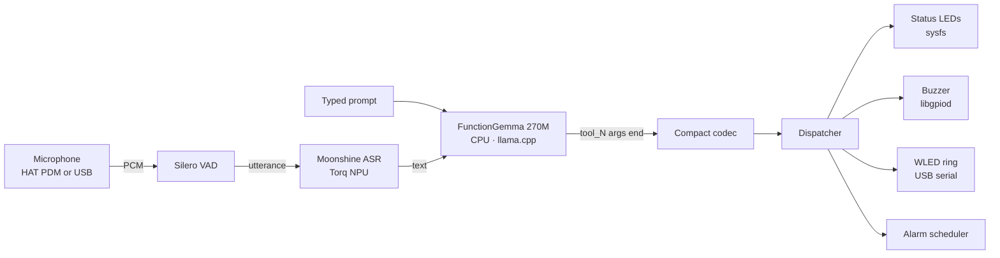

# FunctionGemma — On-Device Voice + Text Physical AI

> Natural-language commands → real hardware, end-to-end on a 2-core A55. No cloud, no API keys, no wake word.

<p align="center">
  
</p>
<p align="center"><em>The PyQt UI on the 7" panel after the prompt "play rainbow" — Neopixels alive at the bottom, tool-call log on the right.</em></p>

<p align="center">
  
  
  
  
</p>

A fine-tuned **FunctionGemma 270M** turns natural-language commands into compact tool calls that dispatch to real HAT hardware: status LEDs (sysfs), a piezo buzzer (libgpiod), and an optional Adafruit Mini Sparkle Motion driving a 48-pixel WS2812B Neopixel ring over USB serial.

**Why it's fast:** trained Octopus-v2 style — one functional token per tool, **no tool schema in the prompt**. The on-device prompt is ~13 tokens vs ~1088 for schema-in-prompt builds. Cold prefill drops from **57.3 s → 0.55 s (105×)** on the 2-core Cortex-A55.

**End-to-end on the board:** model load ~3.6 s, warmup ~1.1 s, then every user turn — including the first — runs in **~1–2 s**. Sub-2 s is the norm, not the exception.

---

## Contents

- [Requirements](#requirements)
- [Quick start](#quick-start)
- [Try saying...](#try-saying)
- [How it works](#how-it-works)
- [Running the demo](#running-the-demo)
- [Voice input](#voice-input)
- [WLED Neopixel ring (optional)](#wled-neopixel-ring-optional)
- [Auto-start on boot (systemd)](#auto-start-on-boot-systemd)
- [CLI reference](#cli-reference)
- [Tool schema (8 functions, v9)](#tool-schema-8-functions-v9)
- [Effects, palettes, intensity](#effects-palettes-intensity)
- [Hardware reference](#hardware-reference)
- [Model and training](#model-and-training)
- [Project layout](#project-layout)
- [Known model behaviors](#known-model-behaviors)
- [Troubleshooting](#troubleshooting)
- [Related work](#related-work)
- [Contributing and support](#contributing-and-support)

---

## Requirements

**Required**
- Synaptics **Coral Dev Board (SL2619)** with the Grinn Coral HAT (RGB status LEDs + piezo buzzer)
- **Astra SDK OOBE image** — ships with `git`, `python3`, `gstreamer`, `gpiod`, and `weston`
- ~500 MB free disk for the model and Python venv
- Network access for `setup.sh` to fetch wheels and the GGUF (or pre-populate `wheelhouse/` and `models/` offline)

**Optional**
- **Adafruit Mini Sparkle Motion (6314)** running WLED firmware over USB-CDC — for the Neopixel ring
- **Adafruit 48-pixel WS2812B ring (2539)** wired to the Sparkle Motion
- A microphone for voice input — either the HAT's PDM mic (`alsasrc hw:0,0`) or any USB mic

---

## Quick start

```bash
# 1. Clone
git clone https://github.com/synaptics-astra-demos/sl2610-examples.git
cd sl2610-examples/Function_calling

# 2. One-liner setup: venv + Python deps + GGUF model
bash scripts/setup.sh

# 3. Run it
source .venv/bin/activate
python3 demo.py                # CLI REPL (works in any terminal)

# For the PyQt UI on the 7" panel, install as a systemd service —
# it handles the Wayland env vars and autostarts on boot:
bash scripts/install-service.sh
```

The model loads in ~3.6 s, then you're at a prompt. To run the PyQt UI from a fresh terminal without systemd, see [Running the demo](#running-the-demo) for the Wayland env vars.

To enable voice (Moonshine ASR on the Torq NPU): `bash scripts/setup.sh --voice` instead, then `bash scripts/install-service.sh --voice moonshine`.

The setup script is idempotent — re-run it anytime to repair a broken install. Add `--offline` to use bundled wheels instead of PyPI.

---

## Try saying...

The following are **verbatim** REPL outputs from the v9 model running on the SL2619 — not simulated, captured from a single REPL session at ~1 s per turn:

```text
>>> Turn the red light on
  set_status_led: led=red state=on
  (1 tool call · 1141 ms)

>>> Turn off the green LED
  set_status_led: led=green state=off
  (1 tool call · 1109 ms)

>>> Blink the blue light three times
  blink_status_led: led=blue count=3
  (1 tool call · 1211 ms)

>>> Set the neopixels to aurora
  set_neopixel_effect: effect=aurora
  (1 tool call · 1097 ms)

>>> Pulse the neopixels in blue
  set_neopixel_effect: effect=pulse color=blue
  (1 tool call · 1208 ms)

>>> Show fireworks on the neopixels
  set_neopixel_effect: effect=fireworks
  (1 tool call · 1110 ms)

>>> Play a siren
  play_buzzer: pattern=siren
  (1 tool call · 977 ms)

>>> Wake me up in thirty seconds
  set_alarm: scheduled alarm_1778638439 @ 2026-05-13T02:14:29
  (1 tool call · 1186 ms)

>>> Set an alarm for 5pm
  set_alarm: scheduled alarm_1778638507 @ 2026-05-13T17:00:00
  (1 tool call · 1636 ms)

>>> How much memory is free?
  get_system_status: {'memory': 83.0}
  (1 tool call · 962 ms)

>>> Cancel all alarms
  cancel_alarm: cancelled 0 (all)
  (1 tool call · 661 ms)

>>> Turn off the lights
  respond: Status LEDs or neopixel ring?
  (1 tool call · 1538 ms)

>>> What can you do?
  respond: I control LEDs, neopixel effects, buzzer patterns, and set alarms.
  (1 tool call · 2424 ms)

>>> Hello there
  respond: Hey.
  (1 tool call · 840 ms)
```

Notice that **"Turn off the lights"** — an ambiguous prompt — correctly routes to `respond()` and asks the user to disambiguate. The training data bakes in this surface-disambiguation behavior so the model doesn't guess. See [Known model behaviors](#known-model-behaviors) for prompts that still misroute, and [Tool schema](#tool-schema-8-functions-v9) for the full surface.

---

## How it works



Three things make this work on a 2-core A55:

1. **Octopus v2 functional tokens.** Each tool is a single token (`<tool_0>` ... `<tool_7>`) baked into the model weights. The on-device prompt is `<start_of_turn>user\n{query}<end_of_turn>\n<start_of_turn>model\n` and nothing else — no JSON schema, no examples, no system message.
2. **CPU governor pinned to `performance`.** The OOBE image defaults to `schedutil`, which causes a 3× slowdown from cold. `cpu_governor.py` flips this on startup.
3. **Moonshine runs on the Torq NPU, not the CPU.** ASR is decoupled from LLM decode, so a spoken utterance and an in-flight tool call don't fight for the same 2 cores.

The compact codec (`compact_codec.py`) parses `<tool_N>(arg1,arg2)<end>` back into a `ToolCall`. The dispatcher (`dispatcher.py`) validates args against `tools.json` and invokes a method on `HardwareDevice` (`hardware.py`). Everything stays local — no network, no cloud inference.

---

## Running the demo

For interactive runs of the PyQt UI from a terminal, export the Wayland env vars first so Qt can find the OOBE image's weston compositor. The systemd service handles this automatically on autostart.

```bash
export XDG_RUNTIME_DIR=/var/run/user/0
export WAYLAND_DISPLAY=wayland-1
export QT_QPA_PLATFORM=wayland
export WESTON_DISABLE_GBM_MODIFIERS=true
```

Activate the venv, then run either entrypoint:

```bash
source .venv/bin/activate

# Interactive REPL
python3 demo.py

# One-shot prompt (~5-6 s end-to-end from cold: load + warmup + decode)
python3 demo.py --prompt "Turn the red light on"

# PyQt UI
python3 app_pyqt.py

# PyQt UI full-screen on the 7" panel
python3 app_pyqt.py --fullscreen
```

In the PyQt UI: `Ctrl+P` snapshots the window to `/tmp/`. `Esc` quits.

### Expected output (REPL)

```text
Loading model from functiongemma-physical-ai-v9-Q5_K_M.gguf done in 3.6s.
HardwareDevice ready (status_leds=3, wled=no, gpiod=yes, buzzer=gpiochip0 6)
Warming up done in 1.1s.
Ready. /help for commands, Ctrl-D or /exit to leave.
>>> Turn the red light on
  set_status_led: led=red state=on
  (1 tool call · 1141 ms)
>>>
```

---

## Voice input

The PyQt UI grows a **Mic** button when voice is enabled, and the REPL accepts spoken utterances mixed with typed input. Both entrypoints take the same `--voice` flag:

| Mode | What it does |
|---|---|
| `--voice off` (default) | No voice. Mic button hidden, spoken input ignored. |
| `--voice stub` | Real mic + VAD; ASR returns rotating canned phrases. Use to validate the mic → VAD → dispatcher path without a real ASR model. |
| `--voice moonshine` | Real mic + VAD + Moonshine ASR on the Torq NPU. Reads VMFB artifacts from `--moonshine-dir` (default `models/Synaptics/moonshine-tiny-bf16-torq/`, populated by `scripts/setup.sh --voice`). |

```bash
# Validate plumbing with stubbed ASR
python3 app_pyqt.py --voice stub

# Real Moonshine ASR on Torq
python3 app_pyqt.py --voice moonshine

# Pin to the HAT PDM mic explicitly
python3 app_pyqt.py --voice moonshine --mic 0
```

`scripts/setup.sh --voice` installs the entire voice toolchain in one shot: `sounddevice`, `silero-vad-notorch`, `onnxruntime`, `tokenizers`, `huggingface_hub`, the `torq_runtime` wheel, five Moonshine artifacts (encoder + decoder + decoder-with-past VMFBs, token embeddings, and tokenizer — fetched from `Synaptics/moonshine-tiny-bf16-torq` on HuggingFace), and `libportaudio.so.2` (extracted from the repo-root `../library/portaudio_libs.tgz` shared across examples — the OOBE image doesn't ship it).

If `tokenizer.json` is ever missing at runtime, the ASR worker falls back to fetching it from `UsefulSensors/moonshine-tiny`. For fully offline use after a partial install:

```bash
wget -O ../models/Synaptics/moonshine-tiny-bf16-torq/tokenizer.json \
  https://huggingface.co/UsefulSensors/moonshine-tiny/resolve/main/tokenizer.json
```

**REPL caveat:** in `demo.py --voice` you can talk *or* type. Voice transcription completes asynchronously, so if a spoken utterance arrives while you're mid-keystroke at the `>>>` prompt, the readline buffer is dropped and you have to retype. Acceptable for headless smoke tests; the PyQt UI doesn't have this problem.

---

## WLED Neopixel ring (optional)

Plug an Adafruit Mini Sparkle Motion (6314) running WLED firmware + a WS2812B Neopixel ring (Adafruit 2539) into a USB-A port and verify it enumerates:

```bash
ls /dev/ttyACM*
```

Then pass `--wled-port`:

```bash
python3 demo.py --wled-port /dev/ttyACM0
python3 app_pyqt.py --wled-port /dev/ttyACM0 --fullscreen
```

Without the WLED hardware, `set_neopixel_effect` calls log to the command pane but no-op silently. The rest of the demo (LEDs, buzzer, alarms, system status, chat) works unchanged.

---

## Auto-start on boot (systemd)

After `scripts/setup.sh` has populated the venv and downloaded the model, install the systemd service to launch the PyQt demo full-screen at boot:

```bash
bash scripts/install-service.sh
```

By default the unit runs `app_pyqt.py --fullscreen`. To pass extra flags at install time, append them — they're baked into the generated `ExecStart=` line:

```bash
bash scripts/install-service.sh --wled-port /dev/ttyACM0
bash scripts/install-service.sh --voice stub --mic 0
```

Other flags:

- `--no-enable` — install the unit but don't enable it on boot
- `--no-start` — enable on boot but don't start it now

The unit:

- waits for `weston.service` (the OOBE image's Wayland compositor)
- exports the Wayland env vars (`XDG_RUNTIME_DIR`, `WAYLAND_DISPLAY`, `QT_QPA_PLATFORM`, `WESTON_DISABLE_GBM_MODIFIERS`)
- runs as `root` from `Function_calling/` with the venv's `python3`
- restarts on failure (5 s back-off, 120 s start timeout — v9 cold start to first response is ~5-6 s, plenty of headroom)
- on stop drives `gpioset $(gpiofind BUZZERn)=1` so the buzzer is silenced even after `SIGKILL`

Day-to-day:

```bash
systemctl status functiongemma-demo
journalctl -u functiongemma-demo -f       # follow logs
systemctl restart functiongemma-demo      # after editing source

bash scripts/uninstall-service.sh         # remove
```

---

## CLI reference

Every runtime knob is a CLI flag — no env vars to remember, no config files to edit. Both `demo.py` and `app_pyqt.py` accept the same flags except where noted.

| Flag | Default | Applies to | Purpose |
|---|---|---|---|
| `--model PATH` | `../models/functiongemma-physical-ai-v9-Q5_K_M.gguf` | both | GGUF path |
| `--prompt TEXT` | — | `demo.py` | One-shot prompt, then exit |
| `--voice MODE` | `off` | both | `off` / `stub` / `moonshine` |
| `--mic INDEX_OR_NAME` | system default | both | Sounddevice device index or substring (e.g. `0`, `hw:0,0`, `USB`) |
| `--moonshine-dir PATH` | `../models/Synaptics/moonshine-tiny-bf16-torq/` | both | Where Moonshine VMFB + tokenizer live |
| `--wled-port PATH` | — | both | Mini Sparkle Motion serial device (e.g. `/dev/ttyACM0`) |
| `--wled-baud N` | `115200` | both | WLED serial baud rate |
| `--screenshot-dir PATH` | `/tmp` | `app_pyqt.py` | Where `Ctrl+P` writes PNGs |
| `--fullscreen` | off | `app_pyqt.py` | Skip window decorations, fill the 7" panel |

---

## Tool schema (8 functions, v9)

| Tool | Args | Effect |
|---|---|---|
| `set_status_led` | `led`, `state`, `brightness?` | Drive one HAT status LED (red / green / blue / all) on or off |
| `blink_status_led` | `led`, `count?`, `speed?` | Blink one HAT status LED N times |
| `set_neopixel_effect` | `effect`, `color?`, `palette?`, `speed?`, `intensity?` | Play an effect on the 48-pixel ring (see tables below) |
| `play_buzzer` | `pattern` | Named pattern on the binary-GPIO buzzer (`beep`, `double_beep`, `chirp`, `siren`, `alarm`, `success`, `error`) |
| `set_alarm` | `duration` \| `time`, `label?` | Schedule alarm (buzzer + flashing) |
| `cancel_alarm` | `label?` | Cancel one or all alarms |
| `get_system_status` | `metric?` | CPU / memory / temperature / NPU |
| `respond` | `message` | Natural-language reply when no tool fits |

The full schema with descriptions lives in `tools.json`. v9 keeps v8's 8-tool surface (surface-specific LED tools — no `turn_on_lights` / `set_led_color` ambiguity) and switches the training pipeline to Octopus v2: functional tokens with **no tool schema in the prompt**. The schema file remains the source of truth for dispatcher arg validation and is embedded as GGUF metadata for schema-drift checks; it's **not** injected into the inference prompt.

### Surface-keyword routing

| Prompt contains... | Routes to... |
|---|---|
| literal `"neopixels"` | `set_neopixel_effect` |
| `"LED"` / `"LEDs"` / `"the <color> light"` | `set_status_led` or `blink_status_led` |
| `"ring"` / `"strip"` without `"neopixels"` | `respond()` clarification |
| Generic `"lights"` with no surface keyword | `respond()` clarification |

The model is fine-tuned with this rule baked in — any `set_neopixel_effect` call whose source prompt lacks `"neopixels"` is a routing failure, not a feature. Ambiguous-lights prompts route to `respond()` for clarification (verified on v9: `"Turn off the lights"` → `respond: Status LEDs or neopixel ring?`).

---

## Effects, palettes, intensity

### Effects (`set_neopixel_effect.effect`)

| Effect | WLED fx | Visual role | Notes |
|---|---|---|---|
| `solid` | 0 | Static color | Uses `color` |
| `pulse` | 2 (Breathe) | Voice activity / breathing | Uses `color` |
| `fade` | 12 | Gentle fade | Uses `color` |
| `chase` | 28 | Runners on dim trail | Uses `color`; secondary auto-dimmed |
| `rainbow` | 9 | Spectrum spread | `color` ignored |
| `sparkle` | 20 | Random twinkle on solid bg | Uses `color` |
| `off` | — | Turn ring off | Sends `on: false` |
| `aurora` | 38 | Northern Lights ambient | Palette-driven |
| `plasma` | 97 | Plasma lamp | Palette-driven |
| `comet` | 41 (Lighthouse) | Trailing dot — "thinking" | Uses `color` |
| `twinkle` | 80 (TwinkleFox) | Gentle random twinkle | Palette-friendly |
| `fireworks` | 42 | Random color blobs | Celebration |
| `police` | 49 | Red/blue alternating | Alert / alarm |
| `heartbeat` | 100 | Biological pulse | Voice activity |
| `loading` | 47 | Sawtooth fill | "Processing" indicator |
| `lightning` | 57 | White random flash | Storm alert |
| `glitter` | 87 | Rainbow + white sparkles | Celebration |
| `fire` | 66 (Fire 2012) | Flickering fire | Palette-friendly |
| `sunrise` | 104 | Gradual sunrise | Slow ambient |

### Palettes (`set_neopixel_effect.palette`)

| Palette | WLED pal | Mood |
|---|---|---|
| `auto` | 0 | Effect default |
| `ocean` | 9 | Blue / teal / white |
| `lava` | 8 | Dark red, yellow, white |
| `forest` | 10 | Yellow + green |
| `sunset` | 13 | Dark blue → purple → red → yellow |
| `party` | 6 | Rainbow without green |
| `sherbet` | 27 | White, pink, mint |
| `c9` | 48 | Christmas lights |
| `aurora` | 50 | Greens on dark blue |
| `beach` | 22 | Light blue shades |
| `fire` | 35 | White, yellow, fading red |
| `sakura` | 49 | Pink and rose |
| `splash` | 19 | Vibrant pink and magenta |
| `pastel` | 20 | Desaturated hues |

### Intensity (`set_neopixel_effect.intensity`)

`low` / `medium` / `high` controls effect density via WLED's `ix` knob — sparkle density, fire height, comet tail length, aurora width, etc.

---

## Hardware reference

- **Coral Dev Board (SL2619)** with the Grinn Coral HAT — RGB status LEDs at `/sys/class/leds/{red,green,blue}:status/brightness`, piezo buzzer on `BUZZERn` (binary GPIO).
- **Optional Adafruit Mini Sparkle Motion (6314)** running WLED firmware, enumerated as `/dev/ttyACM0` over USB-CDC. Drives a 48-pixel WS2812B / SKC6812RV ring (Adafruit 2539).

### Buzzer wiring note

Despite the schematic name suggesting active-low, `BUZZERn` on the Grinn Coral HAT is electrically wired such that the buzzer **silences on the line being driven HIGH and beeps when LOW**. The kernel device tree marks the line `active-high` — so `gpioset gpiochip0 6=1` drives physical HIGH = silent, `=0` = beep. The chip driver also retains the last-driven value across `gpioset --mode=exit`, so once a value is written the line holds it.

`hardware.py` writes the inverted polarity (`0` to beep, `1` to silence). If you port this code to a board with the polarity wired the other way, flip the `_BUZZER_OFF` / `_BUZZER_ON` constants at the top of `hardware.py`. Verify with `gpioinfo gpiochip0` (look for the line named `"BUZZERn"`).

### Crash-safe cleanup

The demo guarantees the buzzer and status LEDs return to a silent/off state on every exit path the Python interpreter can observe:

- Normal exit (`/exit`, EOF, end of `--prompt`)
- Uncaught exceptions
- `KeyboardInterrupt` (Ctrl-C / SIGINT) mid-pattern
- `SIGTERM` (e.g. `kill <pid>`, init shutdown)
- `SIGHUP` (terminal close, parent process death)
- A fresh demo loading `hardware.py` after a crashed prior process

Layered as `try/finally` inside `play_buzzer` + `blink_status_led`, a `HardwareDevice.cleanup()` called from a `finally` block in `main()`, signal handlers for `SIGTERM`/`SIGHUP`, and an `atexit` net.

`SIGKILL`, kernel OOM kill, segfault, and power loss bypass all in-process cleanup. The systemd unit installed by `scripts/install-service.sh` carries an `ExecStopPost=` that drives `BUZZERn` back to silent on every service exit, including `SIGKILL` — so the buzzer can never latch ON across an unclean restart.

---

## Model and training

Hosted on HuggingFace: [`BrinqAI/functiongemma-270m-physical-ai`](https://huggingface.co/BrinqAI/functiongemma-270m-physical-ai) → `functiongemma-physical-ai-v9-Q5_K_M.gguf` (248 MB).

- **Base:** [`google/functiongemma-270m-it`](https://huggingface.co/google/functiongemma-270m-it)
- **Style:** Fine-tuned [Octopus v2](https://arxiv.org/abs/2404.01744) — one functional token per tool, no schema in prompt
- **Dataset:** 6,127 train / 1,339 eval examples — Haiku-authored phrasing templates × deterministic entity pools, with light Moonshine-flavored ASR-noise augmentation
- **Surface:** 8 tools + `respond()` fallback (training data includes multi-tool routines, but on-device dispatch is unreliable for now — see [Known model behaviors](#known-model-behaviors))
- **Held-out smoke test:** 29/29 (100%) on a curated routing benchmark; real-world prompt distribution is wider — see [Known model behaviors](#known-model-behaviors)
- **Cold prefill:** 0.55 s on the SL2619 2-core A55 (105× faster than the v7 schema-in-prompt build, synthetic benchmark)

The optional voice path uses Moonshine VMFB artifacts from a separate HF repo: [`Synaptics/moonshine-tiny-bf16-torq`](https://huggingface.co/Synaptics/moonshine-tiny-bf16-torq) under the `moonshine/` subdir, fetched automatically by `scripts/setup.sh --voice`.

---

## Project layout

```
Function_calling/
├── app_pyqt.py            # PyQt5 entrypoint (the UI demo)
├── demo.py                # CLI / REPL entrypoint
├── chat_window.py         # main UI window
├── command_log.py         # scrolling tool-call log widget
├── compact_codec.py       # <tool_N>(args)<end> ↔ ToolCall
├── cpu_governor.py        # forces "performance" governor on the A55
├── dispatcher.py          # ToolCall → HardwareDevice method
├── hardware.py            # status LEDs, buzzer, alarms, camera
├── llamacpp.py            # llama-cpp-python wrapper for the GGUF
├── metrics_panel.py       # top-pane sparklines
├── metrics_provider.py    # psutil + sysfs samplers
├── theme.py               # Qt palette / typography
├── tools.json             # 8-tool schema (v9)
├── wled.py                # Mini Sparkle Motion serial client
├── voice/
│   ├── asr.py             # StubASR + MoonshineASR (delegates to utils.speech)
│   ├── pipeline.py        # start/stop/callback API on top of utils.speech
│   └── __init__.py        # make_voice_pipeline factory
├── scripts/
│   ├── setup.sh           # first-time install
│   ├── install-service.sh # systemd autostart installer
│   └── uninstall-service.sh
├── tests/                 # pytest: alarms, dispatcher, voice, wled-serial
└── requirements.txt

# Shared with the rest of the repo:
../utils/speech.py         # mic capture + silero VAD + Moonshine transcriber
../library/                # shared native libs (portaudio_libs.tgz, etc.)
../wheelhouse/             # pre-built aarch64 wheels (populated by setup.sh)
../models/                 # GGUF + Moonshine artifacts (populated by setup.sh)
  functiongemma-physical-ai-v9-Q5_K_M.gguf       # core demo
  Synaptics/moonshine-tiny-bf16-torq/            # only with --voice
    encoder.vmfb
    decoder.vmfb
    decoder_with_past.vmfb
    decoder_token_embeddings.npy
    tokenizer.json
```

---

## Known model behaviors

A 270M model fine-tuned for tool routing is not GPT-4. Below is what we've measured from a sweep against the v9 model on the board. Patterns that route cleanly vs. patterns that still misroute:

**Reliable (verified on v9):**

| Pattern | Example |
|---|---|
| `<color> light/LED on/off` | `Turn the red light on` → `set_status_led` |
| `blink <color> <N> times` | `Blink the blue light three times` → `blink_status_led` |
| `<effect> on the neopixels` | `Show fireworks on the neopixels` → `set_neopixel_effect` |
| `pulse the neopixels in <color>` | → `set_neopixel_effect: effect=pulse color=blue` |
| `play a <pattern>` | `Play a siren` → `play_buzzer` |
| `wake me up in <N> <unit>` | `Wake me up in thirty seconds` → `set_alarm` |
| `set an alarm for <time>` | `Set an alarm for 5pm` → `set_alarm @ 17:00:00` |
| `cancel all alarms` | → `cancel_alarm: cancelled 0 (all)` |
| `how much <metric>` | `How much memory is free?` → `get_system_status` |
| Ambiguous-surface clarification | `Turn off the lights` → `respond: Status LEDs or neopixel ring?` |
| Conversational | `Hello there` → `respond: Hey.` |

**Misroutes we've observed:**

- **Multi-tool prompts** ("Beep twice and flash the green LED") — emit one malformed call, not two. The dispatcher rejects with an arg validation error. **Stick to one action per prompt** for now.
- **Short imperatives without a surface keyword** ("Beep twice") — model routes to `play_buzzer` but emits `pattern='double'` instead of `'double_beep'`. Phrase as `Play a double beep` to land an exact-match pattern.
- **Effects that need an exact name** ("Make the neopixels look like a police car") — model emits `palette='car'` (not a defined palette). Use the literal effect name: `Make the neopixels do the police effect`. See the [Effects table](#effects-set_neopixel_effecteffect) for the closed set.
- **Specific system metrics** ("What's the CPU temperature?") — routes to `get_system_status` but picks `metric=cpu` instead of `temperature`. Ask `What's the temperature?` for a cleaner hit.
- **Free-form chat** ("Tell me a joke about embedded systems") — the v9 model often emits 0 tool calls (gives up gracefully) rather than misrouting. That's a feature, not a bug — the model is fine-tuned for tool routing, not open-ended conversation.

If you hit a misroute on a phrasing you think should work, file an issue with the verbatim prompt — the fix is to add it to the next dataset regen and retrain.

---

## Troubleshooting

<details>
<summary><strong>PyQt UI doesn't launch / "could not connect to display"</strong></summary>

Qt needs Wayland env vars. Either run via the systemd service (handled for you), or export them in your shell:

```bash
export XDG_RUNTIME_DIR=/var/run/user/0
export WAYLAND_DISPLAY=wayland-1
export QT_QPA_PLATFORM=wayland
export WESTON_DISABLE_GBM_MODIFIERS=true
```

If `weston.service` isn't running, the panel won't render anything: `systemctl status weston`.
</details>

<details>
<summary><strong><code>/dev/ttyACM0</code> not found when WLED is plugged in</strong></summary>

Confirm the Sparkle Motion enumerated:

```bash
lsusb | grep -i esp        # should show the ESP32-S3
dmesg | tail -20           # look for "cdc_acm" attach
ls /dev/ttyACM*
```

If it enumerates as `ttyACM1` or higher, pass that path explicitly to `--wled-port`. If nothing shows up, try a different USB-A port or cable — some USB-C-to-A cables are charge-only.
</details>

<details>
<summary><strong>Buzzer stuck ON after a crash</strong></summary>

The chip driver latches the last value. Silence it manually:

```bash
gpioset $(gpiofind BUZZERn)=1
```

Or restart the service (the unit's `ExecStopPost=` does this automatically):

```bash
systemctl restart functiongemma-demo
```

If buzzer polarity *looks* inverted on a future board revision, see [Buzzer wiring note](#buzzer-wiring-note).
</details>

<details>
<summary><strong>Microphone not picking up audio / wrong device</strong></summary>

List available devices:

```python
python3 -c "import sounddevice as sd; print(sd.query_devices())"
```

The HAT PDM mic enumerates as device 0 (`klamath-asoc, hw:0,0`). Plugging in a USB mic typically bumps it to position 1+ and steals the system default. Pin explicitly:

```bash
python3 app_pyqt.py --voice moonshine --mic 0           # HAT PDM
python3 app_pyqt.py --voice moonshine --mic USB         # USB mic by substring
```
</details>

<details>
<summary><strong>Moonshine VMFBs missing / "decoder.vmfb not found"</strong></summary>

Re-run setup with the voice flag:

```bash
bash scripts/setup.sh --voice
```

For offline boards, manually fetch from `huggingface.co/Synaptics/moonshine-tiny-bf16-torq/tree/main/moonshine` and drop into `../models/Synaptics/moonshine-tiny-bf16-torq/`.
</details>

<details>
<summary><strong>Cold prefill is way slower than 0.5 s</strong></summary>

The CPU governor probably reverted to `schedutil` (3× slowdown). Check:

```bash
cat /sys/devices/system/cpu/cpu0/cpufreq/scaling_governor
```

Should report `performance`. `cpu_governor.py` flips this at startup, but if you're benchmarking outside the demo:

```bash
echo performance | sudo tee /sys/devices/system/cpu/cpu*/cpufreq/scaling_governor
```

Back-to-back cold runs can also thermal-throttle the A55 — let the board cool 30 s between full reloads.
</details>

<details>
<summary><strong>The model picked the wrong tool / hallucinated args</strong></summary>

See [Known model behaviors](#known-model-behaviors) for the specific patterns we've measured to misroute and the rephrasings that work. If your prompt isn't covered there, file an issue with the verbatim prompt — fixes land in the next dataset regen.
</details>

---

## Related work

- [**Octopus v2 paper**](https://arxiv.org/abs/2404.01744) — Nexa AI, the functional-token approach this model follows
- [**FunctionGemma 270M**](https://huggingface.co/google/functiongemma-270m-it) — Google's base model
- [**Moonshine**](https://github.com/usefulsensors/moonshine) — Useful Sensors' compact ASR model
- [**WLED**](https://kno.wled.ge/) — open-source LED control firmware
- [**llama.cpp**](https://github.com/ggerganov/llama.cpp) — GGUF inference runtime
- [**IREE**](https://iree.dev/) — MLIR-based runtime powering Torq on the SL2619 NPU

---

## Contributing and support

- **Issues / bugs:** file at [github.com/synaptics-astra-demos/sl2610-examples/issues](https://github.com/synaptics-astra-demos/sl2610-examples/issues)
- **Forum:** [Synaptics AI Developer Zone](https://developer.synaptics.com/)
- **Pull requests welcome** — especially new tool integrations, additional WLED effects, and bug fixes for routing failures. Include the failing prompt in the PR description.

Tested on Coral Dev Board (SL2619) running the Astra SDK OOBE image.
